# Task Tracking Web App

Small **production-like Todo application** built with **Next.js (React + TS)** + **FastAPI (Python)** + **PostgreSQL**, containerized with **Docker Compose**, and featuring database migrations (Alembic) and tests.

---

## 🧱 Tech Stack

- **Frontend**: Next.js 15 (React 19, TypeScript), Tailwind CSS v4, React Query
- **Backend**: FastAPI (Python 3.13), SQLAlchemy 2, Alembic
- **Database**: PostgreSQL 16 (Docker)
- **Local Infra**: Docker Compose

---

## 📦 Requirements

- Docker Desktop
- Node.js 20.x (for frontend development)
- (Optional) Python 3.13 if you want to run backend outside Docker

---

## 🚀 Quickstart (Docker Compose)

```bash
# 1) Clone repository
git clone <repo-url>
cd task-tracking-web-app

# 2) Environment variables
cp server/.env.example server/.env

# 3) Start services
docker compose up -d --build

# 4) Run migrations
docker compose exec server bash -lc "alembic upgrade head"

# 5) (Optional) Seed demo data
docker compose exec server bash -lc "python -m src.seeds"
```

## Local Development (Without Docker)

```bash
cd server
python3.13 -m venv .venv && source .venv/bin/activate
python -m pip install -U pip

# Install dependencies from pyproject
python -m pip install -r <(python - <<'PY'
import tomllib; print("\n".join(tomllib.load(open("pyproject.toml","rb"))["project"]["dependencies"])) PY)

# Apply migrations
alembic upgrade head

# Run server
uvicorn src.main:app --reload --port 8000

```

## Frontend

```bash
cd app
npm install
npm run dev
```

## Create **app/.env.local**:

```ini
NEXT_PUBLIC_API_URL=http://localhost:8000
```

## Environment Variables

server/.env.example

```ini
DATABASE_URL=postgresql+psycopg://postgres:postgres@db:5432/todo
CORS_ORIGINS=http://localhost:3000
```

app/.env.local

```ini
NEXT_PUBLIC_API_URL=http://localhost:8000
```

## 🗃️ Migrations and Seeds

```bash
# Create new autogenerated migration
docker compose exec server alembic revision --autogenerate -m "add <change>"

# Apply migrations
docker compose exec server alembic upgrade head

# Load demo seeds
docker compose exec server python -m src.seeds
```

## Testing

```bash
# Inside container
docker compose exec server python -m pytest -v

# Or locally
PYTHONPATH=server pytest -v server/tests
```

Includes tests for:

- GET /health

- POST /tasks

- CRUD operations

## API Endpoints (summary)

- `GET /health` → `{"status":"ok"}`

- `GET /tasks` → `List tasks`

- `POST /tasks { "title": "..." }` → `201 + new task`

- `DELETE /tasks/{id}` → `204`

### Examples

```bash
curl -s http://localhost:8000/tasks | jq
curl -s -X POST http://localhost:8000/tasks \
  -H 'content-type: application/json' \
  -d '{"title":"Read docs"}' | jq
```

## Architecture

## Data Model (ERD)


## Request flow (create/list tasks)

```mermaid
sequenceDiagram
  participant User as 👤 User (Browser)
  participant Next as 🟦 Next.js (Frontend - Host)
  participant API as 🟩 FastAPI (Backend - Docker)
  participant DB as 🟨 PostgreSQL (Docker)

  User->>Next: Click "Add" / load page
  Next->>API: POST /tasks {"title":"..."} / GET /tasks
  API->>DB: INSERT / SELECT via SQLAlchemy
  DB-->>API: Affected rows / task list
  API-->>Next: 201 Created / 200 OK (JSON)
  Next-->>User: Update UI (React Query invalidates/refetches)

```



## Useful Commands

```bash
# Root
docker compose up -d
docker compose down -v

# Backend
docker compose exec server alembic upgrade head
docker compose exec server python -m pytest -v

# Frontend
cd app && npm run dev
```

## Troubleshooting

- Port 5432 already in use: change to 5433:5432 in docker-compose.yml or stop local Postgres.

- CORS errors: check CORS_ORIGINS=http://localhost:3000.

- Tailwind v4 issues: ensure @import "tailwindcss"; and PostCSS config includes @tailwindcss/postcss.

- httpx test errors: use ASGITransport(app=app) (httpx ≥ 0.28).
